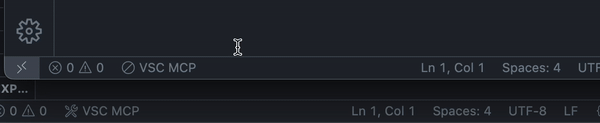

# VSC-MCP Server

A VSCode extension that exposes your IDE as an MCP server — compensating for missing capabilities required by AI agents and enabling advanced control.

## Local Build & Installation

To build and install the extension and relay locally:

### Build the Extension

```bash
cd packages/extension
npx vsce package --no-dependencies --allow-missing-repository
```

Install the packaged extension from disk:

```bash
code --install-extension packages/extension/vsc-mcp-server-0.1.0.vsix
```

### Build and Link Relay

```bash
cd packages/relay
npm run build
npm pack
npm link
```

After linking, running via `npx` will use your local relay version.

### Command Line Options

- `--server-url`: Base URL of the MCP server (default: <http://localhost:60100>)
- `--listen-port`: Starting port to listen for incoming JSON-RPC messages (default: 6011)
- `--disable`: Disable specific tools from being displayed (e.g., `--disable text_editor --disable list_directory`)
- `--enable`: Enable only specific tools (whitelist mode) - when used, only specified tools will be available (e.g., `--enable execute_command --enable code_checker`)

## Key Features

### Terminal Operations

- Execute commands within VSCode’s integrated terminal (supports background/foreground execution, and timeout settings).


### Multi-instance Switching

- Easily switch the MCP server between multiple open VSCode windows.(Just by clicking the status bar item)



### Relay Functionality

- Returns the built-in tools defined in the relay's `initial_tools.ts`.
- Proxies tool execution to the VSC-MCP extension at `--server-url`.

## Available Built-in Tools

- **execute_command**: Execute commands in VSCode’s integrated terminal
- **code_checker**: Retrieve current diagnostics for your code
- **focus_editor**: Focus specific locations within files
- **get_terminal_output**: Fetch output from a specified terminal

## Configuration

1. Configure your MCP client:

    - **Clients like VSCode, Cursor, Trae**: Add the following to your configuration file (`mcp.json`):

    ```json
    {
      "mcpServers": {
        "vscode": {
          "command": "npx",
          "args": [
            "-y",
            "vsc-mcp",
            "--server-url",
            "http://localhost:PORT",
            "--enable",
            "execute_command",
            "--enable",
            "code_checker",
            "--enable",
            "get_terminal_output"
          ]
        }
      }
    }
    ```

2. Check the MCP server status in the bottom-left VSCode status bar:

    - (Server icon): Server is running
    - ∅: Click to start the server


## Attribution

This project is a fork of [acomagu/vscode-as-mcp-server](https://github.com/acomagu/vscode-as-mcp-server) by Yuki Ito. Original copyrights and third-party notices are retained under Apache-2.0. This distribution is maintained by [Ivan Mezentsev](https://github.com/ivan-mezentsev).
