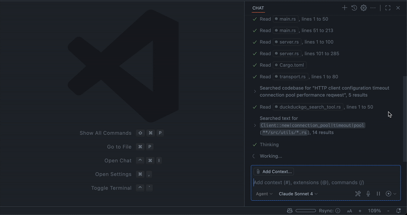

# VSC-MCP Server

A VSCode extension that exposes your IDE as an MCP server — compensating for missing capabilities required by AI agents and enabling advanced control.

## Key Features

### Ask Report "Human In The Loop"

- Interactive webview to prompt the user with Markdown content and predefined options or custom input. Includes copy-to-clipboard, external links handling, submit/cancel actions, and a configurable countdown timer with pause/resume.



Example of "Human In The Loop" mode in chat of Github Copilot:

```text
Can you check the docs and explain how the project works? #vscode
```

### Terminal Operations

- Execute commands within VSCode’s integrated terminal (supports background/foreground execution, and timeout settings).


## Available Built-in Tools

- **execute_command**: Execute commands in VSCode’s integrated terminal
- **code_checker**: Retrieve current diagnostics for your code
- **focus_editor**: Focus specific locations within files
- **get_terminal_output**: Fetch output from a specified terminal
- **ask_report**: Prompt the user via a webview using Markdown and optional predefined options.

## Quick Start

1. Install from the Visual Studio Marketplace
  [Visual Studio Marketplace — vsc-mcp-server](https://marketplace.visualstudio.com/items?itemName=ivan-mezentsev.vsc-mcp-server)
2. Disable the IDE's default terminal tools
  
3. Configure your MCP client:
  Clients like VSCode, Cursor, Trae: add the following to your configuration file (mcp.json):

    ```json
    {
      "mcpServers": {
        "vscode": {
          "command": "npx",
          "args": [
            "vsc-mcp"
          ],
          "type": "stdio",
          "env": {
            "DISCOVERY_PORT": 60100
          }
        }
      }
    }
    ```

4. Check the MCP server status in the bottom-left VSCode status bar:

    
5. Recommended rules for AI agents:

    ```markdown
    ## Code Development
    - **After code editing**: Always check code using `mcp_vscode_code_checker` tool

    ## Tools Priority
    - **Rule**: Always use ONLY `mcp_vscode_execute_command`, `mcp_vscode_get_terminal_output` instead of any other command line tool to perform tasks

    ## Terminal Analysis
    - **CRITICAL**: MUST always read and analyze complete terminal output, not just exit code
    - **Forbidden**: Never make assumptions based solely on exit codes
    - **Required**: Always examine actual output text, error messages, warnings, and any other information displayed before providing response or next steps

    ## Decision Making
    - **Ambiguous tasks**: ALWAYS clarify using `mcp_vscode_ask_report` tool
    - **Requires decisions**: ALWAYS clarify using `mcp_vscode_ask_report` tool

    ## Code Development
    - **Final confirmation**: MUST ask user if all requirements from specification are completed using `mcp_vscode_ask_report` tool with work report

    ## Final gate
    - Before ANY final answer (after actions/edits/checks), it is **MANDATORY** to call `mcp_vscode_ask_report` with a report on the work done and the option ["Yes, everything is OK"].
    - If the answer is not "Yes, everything is OK" — continue working until the comments are resolved and repeat every time `mcp_vscode_ask_report`.
    - There are no exceptions (including minor edits).
    ```

## Local Build & Installation

### Build the Extension

```bash
cd packages/extension
npx vsce package --no-dependencies --allow-missing-repository
```

Install the packaged extension from disk:

```bash
code --install-extension packages/extension/vsc-mcp-server-0.1.0.vsix
```

### Build the proxy

```bash
cd packages/proxy
npm run build
```

Install the built proxy from disk:

```bash
npm link
```

## Attribution

This project is a fork of [acomagu/vscode-as-mcp-server](https://github.com/acomagu/vscode-as-mcp-server) by Yuki Ito. Original copyrights and third-party notices are retained under Apache-2.0. This distribution is maintained by [Ivan Mezentsev](https://github.com/ivan-mezentsev).

## Third-Party Licenses

This project bundles third‑party libraries for the ask-report webview inside a single distributable file:

- `packages/extension/media/markdown-deps.js` — contains embedded copies of:
  - [marked](https://github.com/markedjs/marked) (Markdown parser)
  - [highlight.js](https://github.com/highlightjs/highlight.js) (syntax highlighting)
  - [mermaid](https://github.com/mermaid-js/mermaid) (diagram rendering)
- `packages/extension/media/highlight.github.css` — stylesheet adapted from highlight.js GitHub theme for code block styling.

Licenses:

- marked: MIT License — Copyright (c) 2018+, MarkedJS contributors
- highlight.js: BSD 3-Clause License — © 2006-2024, highlight.js contributors
- mermaid: MIT License — Copyright (c) 2014-2024, mermaid-js contributors
